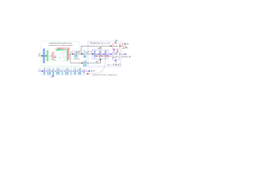

## Concurrent Misclassification and Out-of-Distribution Detection for Semantic Segmentation via Energy-Based Normalizing Flow
UAI 2023 preprint:[https://arxiv.org/abs/2305.09610](https://arxiv.org/abs/2305.09610)

## Abstract
Recent semantic segmentation models accurately classify test-time examples that are similar to a training dataset distribution. However, their discriminative closed-set approach is not robust in practical data setups with distributional shifts and out-of-distribution (OOD) classes. As a result, the predicted probabilities can be very imprecise when used as confidence scores at test time. To address this, we propose a generative model for concurrent in-distribution misclassification (IDM) and OOD detection that relies on a normalizing flow framework. The proposed flow-based detector with an energy-based inputs (FlowEneDet) can extend previously deployed segmentation models without their time-consuming retraining. Our FlowEneDet results in a low-complexity architecture with marginal increase in the memory footprint. FlowEneDet achieves promising results on Cityscapes, Cityscapes-C, FishyScapes and SegmentMeIfYouCan benchmarks in IDM/OOD detection when applied to pretrained DeepLabV3+ and SegFormer semantic segmentation models.

## BibTex Citation
If you like our [paper](https://arxiv.org/abs/2305.09610) or code, please cite it using the following BibTex:
```
@article{flowenedet,
	author    = {Denis Gudovskiy and Tomoyuki Okuno and Yohei Nakata},
	title     = {Concurrent Misclassification and Out-of-Distribution Detection for Semantic Segmentation via Energy-Based Normalizing Flow},
	journal   = {arXiv:2305.09610},
	year      = {2023},
}
```

## Installation
- Clone this repository: tested on Python 3.8
- Install [PyTorch](http://pytorch.org/): tested on v1.11
- This is a fork of [MMSegmentation](https://github.com/open-mmlab/mmsegmentation) v0.28.0
- Download [Cityscapes](https://www.cityscapes-dataset.com/) dataset to your data folder and make a symbolic link to it
- Download [Fishyscapes](https://fishyscapes.com/dataset) dataset to your data folder and make a symbolic link to it
- Download pretrained [DeepLabV3+ ResNet-101 segmentation model](https://download.openmmlab.com/mmsegmentation/v0.5/deeplabv3plus/deeplabv3plus_r101-d8_512x1024_80k_cityscapes/deeplabv3plus_r101-d8_512x1024_80k_cityscapes_20200606_114143-068fcfe9.pth) from [MMSegmentation](https://github.com/open-mmlab/mmsegmentation/tree/master/configs/deeplabv3plus) and copy it to checkpoints folder
- Download pretrained [SegFormer-B2 segmentation model](https://download.openmmlab.com/mmsegmentation/v0.5/segformer/segformer_mit-b2_8x1_1024x1024_160k_cityscapes/segformer_mit-b2_8x1_1024x1024_160k_cityscapes_20211207_134205-6096669a.pth) from [MMSegmentation](https://github.com/open-mmlab/mmsegmentation/tree/master/configs/segformer) and copy it to checkpoints folder
- Other dependencies in requirements.txt
- The following commands reproduce our installation steps:

```
conda create -n flowenedet python=3.8 -y
conda activate flowenedet
cd flowenedet
ln -s ~/PATHTO/data data
conda install pytorch==1.11.0 torchvision==0.12.0 torchaudio==0.11.0 cudatoolkit=11.3 -c pytorch
python -m pip install -U -r requirements.txt
python -m pip install mmcv-full==1.6.1 -f https://download.openmmlab.com/mmcv/dist/cu113/torch1.11.0/index.html
python tools/convert_datasets/cityscapes.py data/cityscapes --nproc 8
curl -o checkpoints/dlv3plus_r101_BASE.pth https://download.openmmlab.com/mmsegmentation/v0.5/deeplabv3plus/deeplabv3plus_r101-d8_512x1024_80k_cityscapes/deeplabv3plus_r101-d8_512x1024_80k_cityscapes_20200606_114143-068fcfe9.pth
curl -o checkpoints/segformer_b2_BASE.pth https://download.openmmlab.com/mmsegmentation/v0.5/segformer/segformer_mit-b2_8x1_1024x1024_160k_cityscapes/segformer_mit-b2_8x1_1024x1024_160k_cityscapes_20211207_134205-6096669a.pth
```

## Task Models and Datasets
- Folder ./local_configs contains all configuration files for task models used in our experiments: DeepLabV3+ with ResNet-101 backbone and SegFormer-B2. Any other model can be extended in a similar way.
- Cityscapes-C is implemented using the imagecorruptions library functions: we add dict(type='Corruptions', mode='test') line to a test_pipeline in each configuration file, except for the original BASE models. The folder ./mmseg/datasets/pipelines/transforms.py contains the actual implementation.

## Training FlowEneDet Detectors
- Any FED detector can be trained using a checkpoint of the pretrained BASE model
- For convenience, we hard-coded SML's statistics in mmseg/models/decode_heads/decode_head.py. However, its train-time statistics can be generated using the estimation script with EST postfix.
- The commands below should reproduce the above steps for SegFormer-B2 model
- We provide FED-U and FDM-C checkpoints that have been used for Fishyscapes and SMIYC (FED-C) leaderboard submissions in ./checkpoints folder

```
CUDA_VISIBLE_DEVICES=0, python tools/train.py local_configs/segformer/segformer.b2.1024x1024.cityf.EST.py  --work-dir checkpoints/segformer_b2_EST  --load-from checkpoints/segformer_b2_BASE.pth --gpus=1
CUDA_VISIBLE_DEVICES=0, python tools/train.py local_configs/segformer/segformer.b2.1024x1024.cityf.FEDU.py --work-dir checkpoints/segformer_b2_FEDU --load-from checkpoints/segformer_b2_BASE.pth --gpus=1
CUDA_VISIBLE_DEVICES=0, python tools/train.py local_configs/segformer/segformer.b2.1024x1024.cityf.FEDC.py --work-dir checkpoints/segformer_b2_FEDC --load-from checkpoints/segformer_b2_BASE.pth --gpus=1
```

## OOD Evaluations on Fishyscapes
- Download our pretrained weights from [Google Drive](https://drive.google.com/drive/folders/1FbPBZ99vYYYPim6HaXwtXavXMib-d0La?usp=sharing)
- Fishyscapes contains two validation dataset: Lost&Found (FSLF) and Static (FSST)
- Folder *local_configs/_base_/datasets* contains data configuration files with a field called *test_dataset*, which by default is set for FSLF
- To select Fishyscapes, assign *test_dataset* to either 'FSLF' or 'FSST' and run scripts below
- Evaluation metrics for Fishyscapes are different than for Cityscapes, hence *--eval mFishy* argument should be used

```
CUDA_VISIBLE_DEVICES=0, python tools/test.py local_configs/segformer/segformer.b2.1024x1024.cityf.SML.py  checkpoints/segformer_b2_BASE.pth --eval mFishy
CUDA_VISIBLE_DEVICES=0, python tools/test.py local_configs/segformer/segformer.b2.1024x1024.cityf.FEDU.py checkpoints/segformer_b2_FEDU.pth --eval mFishy
CUDA_VISIBLE_DEVICES=0, python tools/test.py local_configs/segformer/segformer.b2.1024x1024.cityf.FEDC.py checkpoints/segformer_b2_FEDC.pth --eval mFishy
```

## IDM/OOD Evaluations on Cityscapes and Cityscapes-C
- Cityscapes and Cityscapes-C results can be reproduced by selecting a configuration file (MSP, MLG, ENE, MCD, FEDU, FEDC postfix) and a corresponding checkpoint file
- Cityscapes-C image corruptions are set by a corruption severity level (1-4) and a corruption type (brightness, motion_blur, snow or others from transforms.py), otherwise the original Cityscapes validation dataset is used
- The examples below should reproduce our reference quantitative results (corrupted results should be averaged accoding to our evaluation protocol, which is implemented in parse_results.py script)
- Evaluation metrics for Cityscapes and Cityscapes-C can be selected by appending either closed-set *--eval mIoU* or open-set *--eval oIoU* argument
```
CUDA_VISIBLE_DEVICES=0, python tools/test.py local_configs/segformer/segformer.b2.1024x1024.cityf.MSP.py  checkpoints/segformer_b2_BASE.pth --oIoU
CUDA_VISIBLE_DEVICES=0, python tools/test.py local_configs/segformer/segformer.b2.1024x1024.cityf.ENE.py  checkpoints/segformer_b2_BASE.pth --oIoU
CUDA_VISIBLE_DEVICES=0, python tools/test.py local_configs/segformer/segformer.b2.1024x1024.cityf.MCD.py  checkpoints/segformer_b2_BASE.pth --oIoU
CUDA_VISIBLE_DEVICES=0, python tools/test.py local_configs/segformer/segformer.b2.1024x1024.cityf.SML.py  checkpoints/segformer_b2_BASE.pth --oIoU
CUDA_VISIBLE_DEVICES=0, python tools/test.py local_configs/segformer/segformer.b2.1024x1024.cityf.FEDU.py checkpoints/segformer_b2_FEDU.pth --oIoU
CUDA_VISIBLE_DEVICES=0, python tools/test.py local_configs/segformer/segformer.b2.1024x1024.cityf.FEDC.py checkpoints/segformer_b2_FEDC.pth --oIoU
CUDA_VISIBLE_DEVICES=0, python tools/test.py local_configs/segformer/segformer.b2.1024x1024.cityf.FEDC.py checkpoints/segformer_b2_FEDC.pth --oIoU --corrupt-sev 1 --corrupt-typ snow
```

## FlowEneDet Architecture


## Reference Results for Fishyscapes and SegmentMeIfYouCan val/test splits

